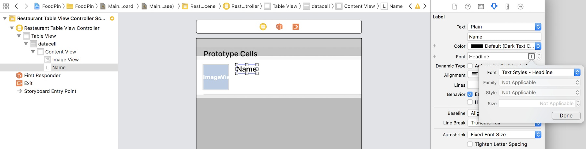

## Customize Table View Cells

- Let's first change the style of the cell. You can't customize the cell when it's set to the *Basic* style. Select the prototype cell and change the style from Basic to *Custom* in the Attributes inspector(把单元格的样式改为自定义)

Next, we will add three labels to the prototype cell:  
- Name - for restaurant name  
- Location - for restaurant location (e.g. New York)  
- Type - for restaurant type (e.g. tea house)  
To add a label, drag a Label object from the Object library to the cell. Name the first label *Name*. Instead of using the system font for the label, we'll use a text style. I will explain to you the difference of a fixed font and a text style in later chapters. For now, just go to the Attributes inspector, and change the font to *Text Styles - Headline* . To change the font to the Headline style, click the *T* button of the font option and change the font from *System to Headline*.

Drag another label to the cell and name it Location. Change the font to *Text Styles-Subhead* and set the font color to *Dark Gray* . Lastly, create another label and name it Type. Similarly, change the font style to *Text Styles- Subhead* and set the font color to *Dark Gray* .

- 设置为*Custom*样式                                                           
  
- 设置高度为 82                                                            
  
- 设置图片大小及位置                                                           
  
- 设置 Name 的样式为 *System to Headline*                                                           
  
- 竖向的 Stack View 的间距为0， Label 会自动设置为最宽。    
  