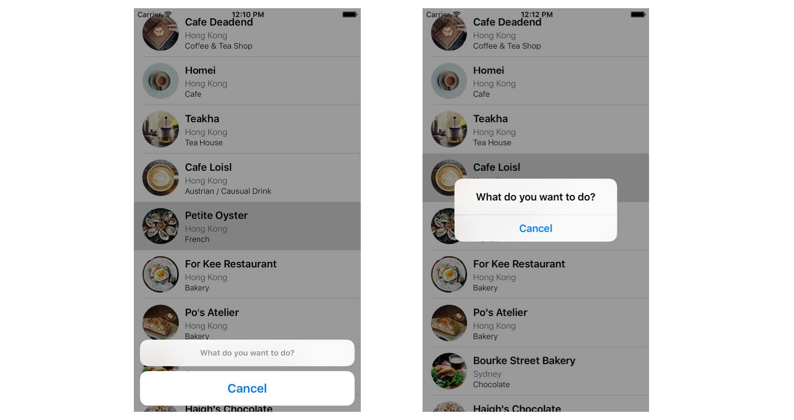

## Chapter 10 Interacting with Table Views and Using UIAlertController

- Displaying an action sheet(code)
```swift
override func tableView(_ tableView: UITableView, didSelectRowAt indexPath: IndexPath) {
    // Create an option menu as an action sheet
    let optionMenu = UIAlertController(title: nil, message: "What do you want to do?", preferredStyle: .actionSheet)
    // Add actions to the menu
    let cancelAction = UIAlertAction(title: "Cancel", style: .cancel, handler: nil)
    optionMenu.addAction(cancelAction)
    // Display the menu
    present(optionMenu, animated: true, completion: nil)
}
```

- Displaying an action sheet(snapshot)             
  


### ActionSheet (left) and Alert (right)

Referring to the code snippet in the previous section, you can specify the style of the UIAlertController object through the *preferredStyle* parameter. You can either set its value to *.actionSheet* or *.alert* .
(preferredStyle两种不同的风格）
 

- Add Call action  
```swift
// Add Call action
let callActionHandler = { (action:UIAlertAction!) -> Void in
    let alertMessage = UIAlertController(title: "Service Unavailable",
                                         message: "Sorry, the call feature is not available yet. Please retry later.",
                                         preferredStyle: .alert)
    alertMessage.addAction(UIAlertAction(title: "OK", style: .default, handler: nil))
    self.present(alertMessage, animated: true, completion: nil)
}
let callAction = UIAlertAction(title: "Call " + "123-000-\(indexPath.row)",
                                style: .default,
                                handler: callActionHandler)
optionMenu.addAction(callAction)
```

- Add Check-in action  
```swift
// Check-in action
let checkInAction = UIAlertAction(title: "Check in", style: .default, handler: {
    (action:UIAlertAction!) -> Void in
    let cell = tableView.cellForRow(at: indexPath)
    cell?.accessoryType = .checkmark
})
optionMenu.addAction(checkInAction)
```