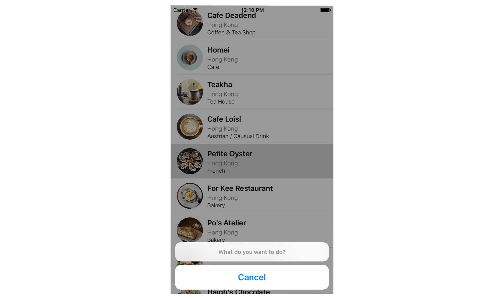

## Chapter 10 Interacting with Table Views and Using UIAlertController

- Displaying an action sheet(code)
```
override func tableView(_ tableView: UITableView, didSelectRowAt indexPath: IndexPath) {
    // Create an option menu as an action sheet
    let optionMenu = UIAlertController(title: nil, message: "What do you want to do?", preferredStyle: .actionSheet)
    // Add actions to the menu
    let cancelAction = UIAlertAction(title: "Cancel", style: .cancel, handler: nil)
    optionMenu.addAction(cancelAction)
    // Display the menu
    present(optionMenu, animated: true, completion: nil)
}
```

- Displaying an action sheet(snapshot)             
  
