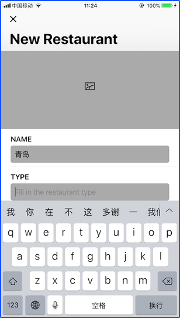

## Moving onto the Next Text Field

创建 *NewRestaurantController* ，为 *UITableViewController* 的子类 .

去掉下面两个方法
```
override func numberOfSections(in tableView: UITableView) -> Int {
	// #warning Incomplete implementation, return the number of sections
	return 0
}
override func tableView(_ tableView: UITableView, numberOfRowsInSection section: I
nt) -> Int {
	// #warning Incomplete implementation, return the number of rows
	return 0
}
```

- 创建各种 IBOutlet 并设置tag值
```
@IBOutlet var photoImageView: UIImageView!
    
@IBOutlet var nameTextField: RoundedTextField! {
    didSet {
        nameTextField.tag = 1
        nameTextField.becomeFirstResponder()
        nameTextField.delegate = self
    }
}
    
@IBOutlet var typeTextField: RoundedTextField! {
    didSet {
        typeTextField.tag = 2
        typeTextField.delegate = self
    }
}
    
@IBOutlet var addressTextField: RoundedTextField! {
    didSet {
        addressTextField.tag = 3
        addressTextField.delegate = self
    }
}
    
@IBOutlet var phoneTextField: RoundedTextField! {
    didSet {
        phoneTextField.tag = 4
        phoneTextField.delegate = self
    }
}
    
@IBOutlet var summaryTextView: UITextView! {
    didSet {
        summaryTextView.tag = 5
        summaryTextView.layer.cornerRadius = 5.0
        summaryTextView.layer.masksToBounds = true
    }
}
```

- 实现协议 UITextFieldDelegate 中的方法  
```  
// MARK: - UITextFieldDelegate methods

func textFieldShouldReturn(_ textField: UITextField) -> Bool {
    // 获取tag + 1 的文本框
    if let nextTextField = view.viewWithTag(textField.tag + 1) {
        // 如果存在，则把当前的文本框解绑首个响应者
        textField.resignFirstResponder()
        // 下一个文本框作为首个响应者
        nextTextField.becomeFirstResponder()
    }
    
    return true
}  
```

- 关联控件
  

- 实现效果
在每个输入框输入文字点击【换行】后，进入下一个控件      
  


You need to grant the app access to your photo library so you can pick your favorite restaurant photo.

Privacy - Photo Library Usage Description" for the key and
set the value to:
You need to grant the app access to your photo library so you can pick your favorite restaurant photo.
Repeat the same procedure and add another row. Set the key to "Privacy - Camera Usage Description" and the value to:
You need to grant the app access to your camera in order to take photos.


- 去掉表格之间的分割线
```
// Configure table view
tableView.separatorStyle = .none
```
        