# Chapter 21 Building Walkthrough Screens with UIPageViewController and Container Views

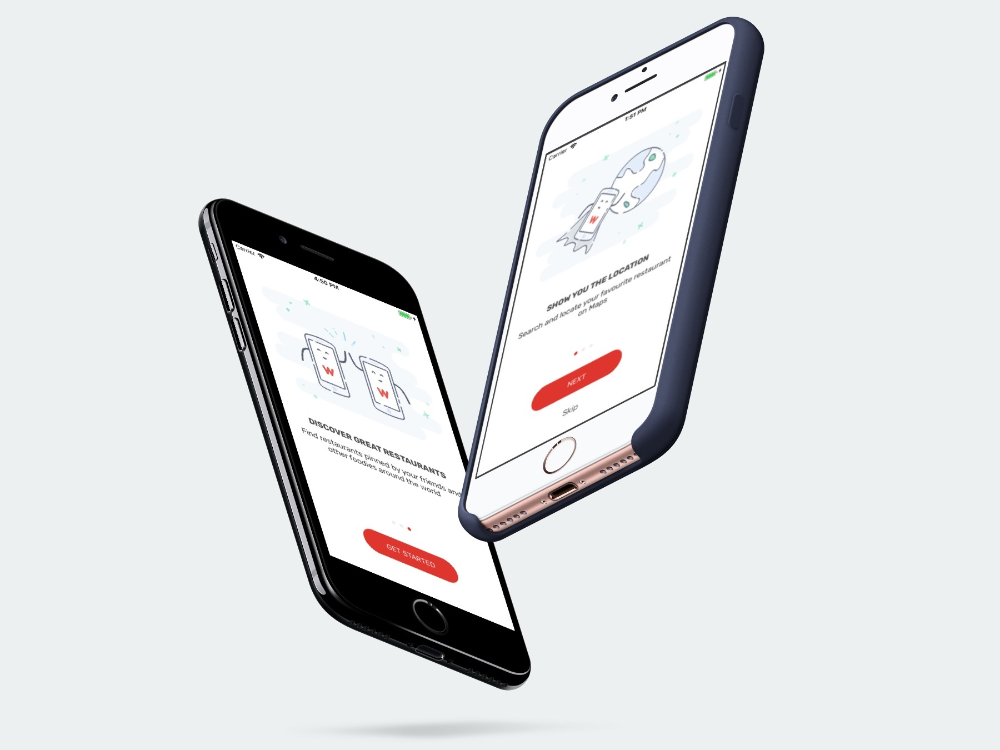

- 最终效果                        
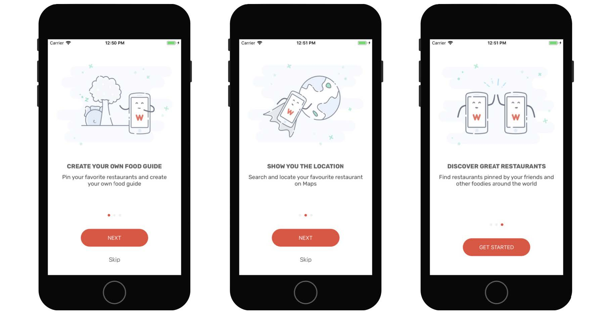

- 设置转场效果  
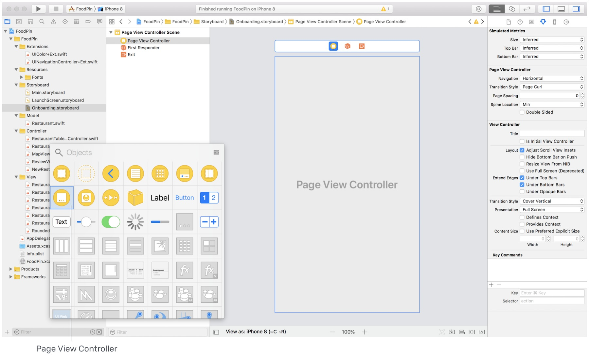
In the Attributes inspector, change the transition style to *Scroll* .

- Figure 21-4. Adding a UIPageViewController to the storyboard
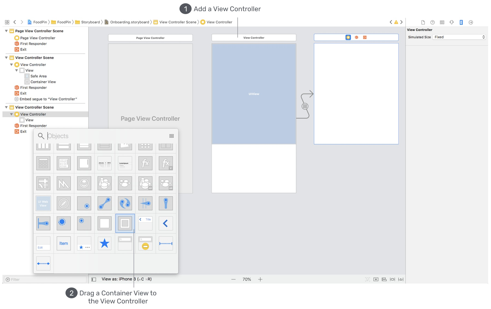

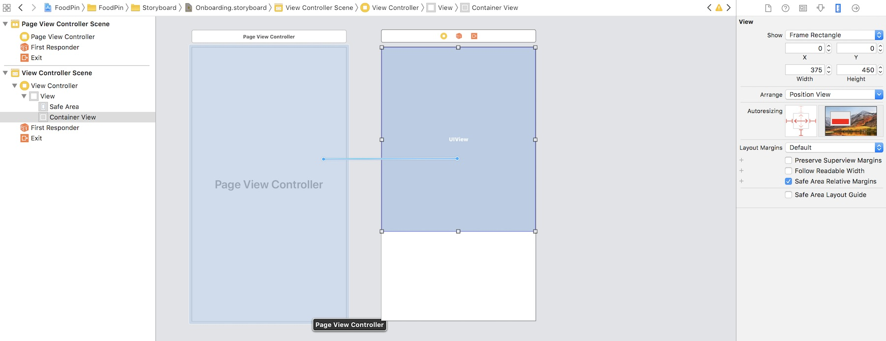

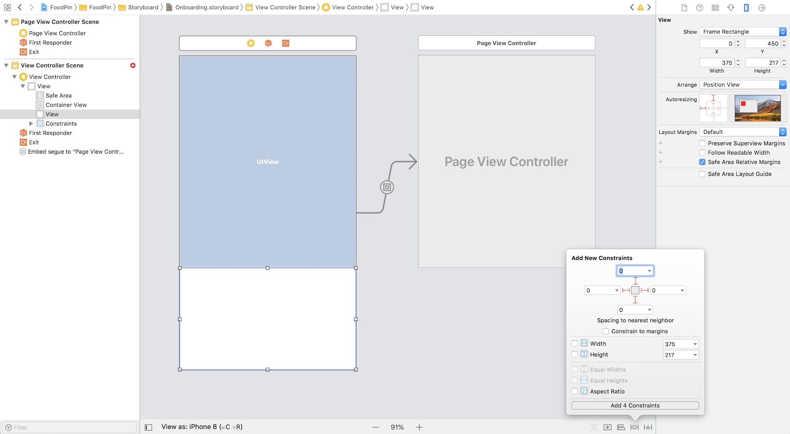

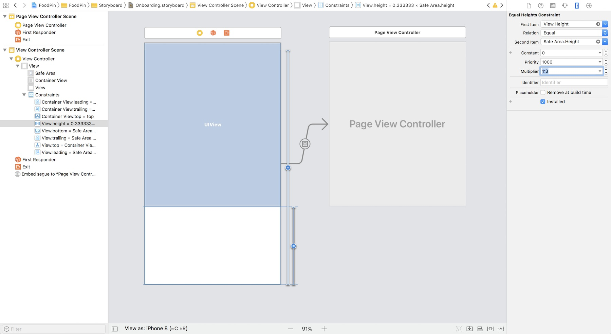
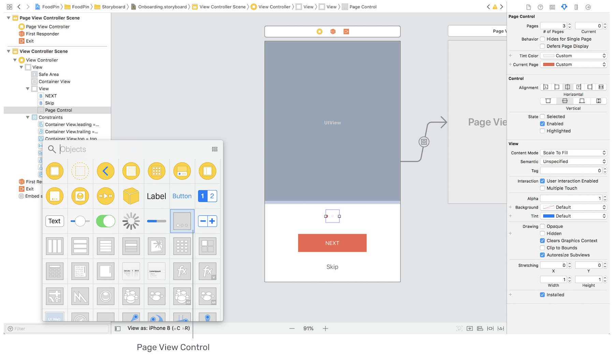
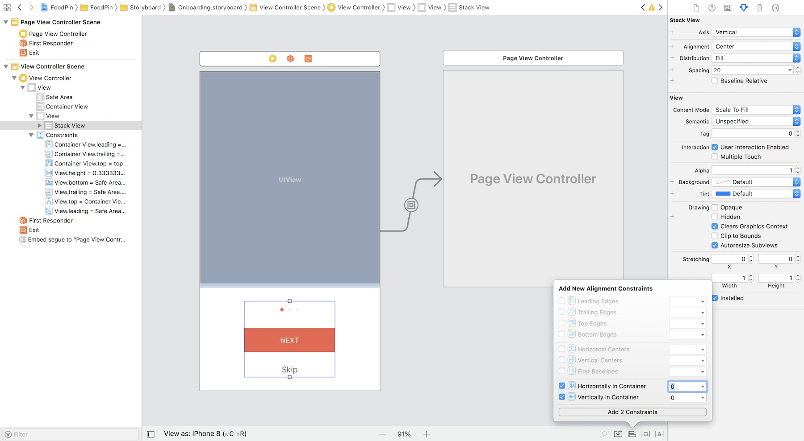

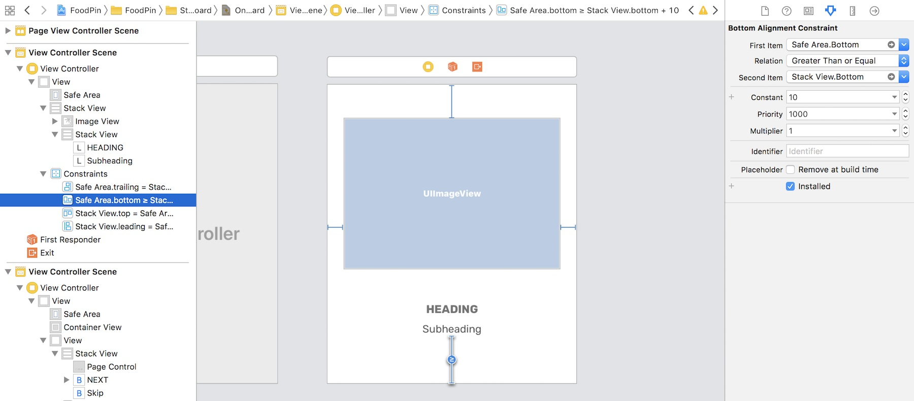

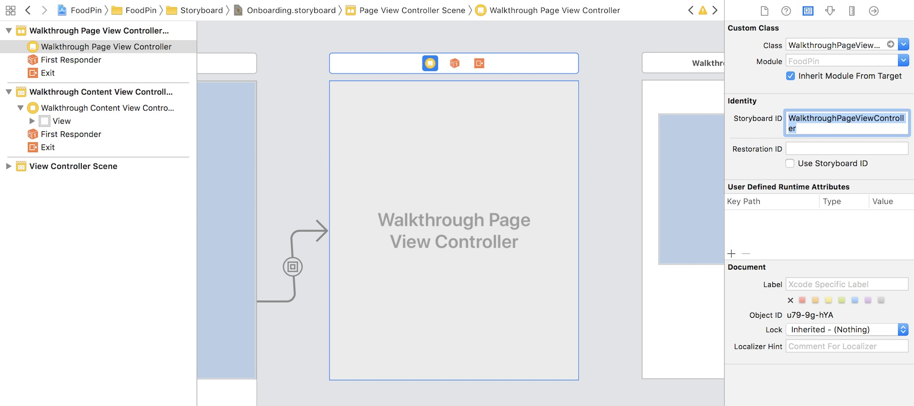
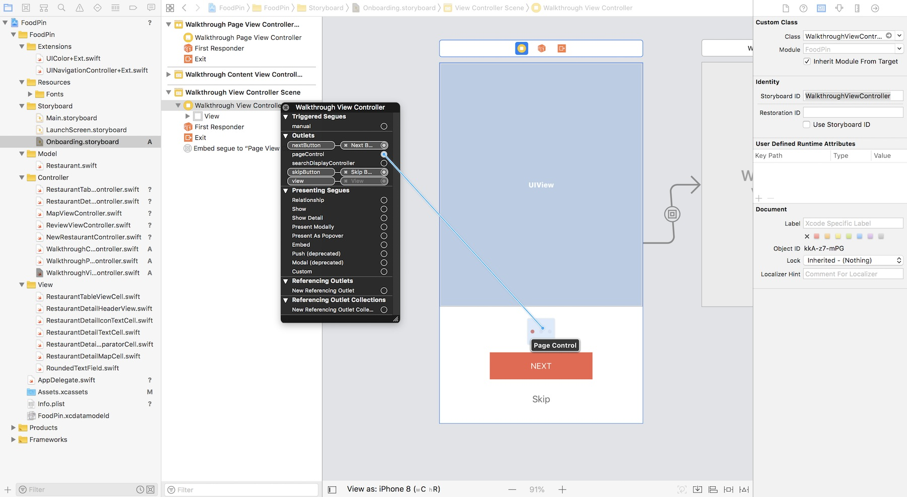
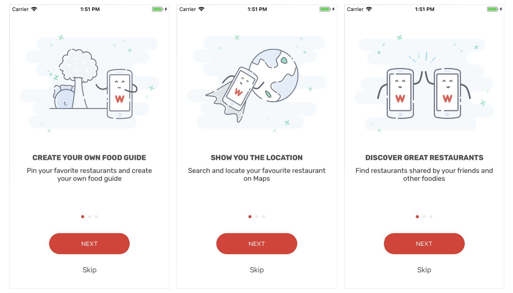