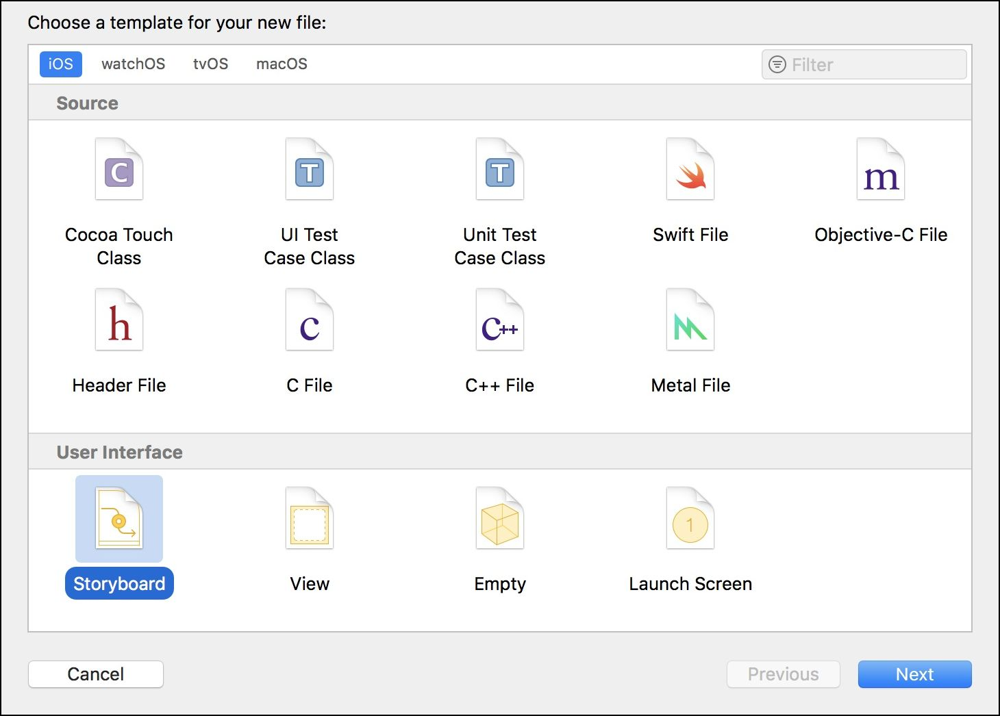
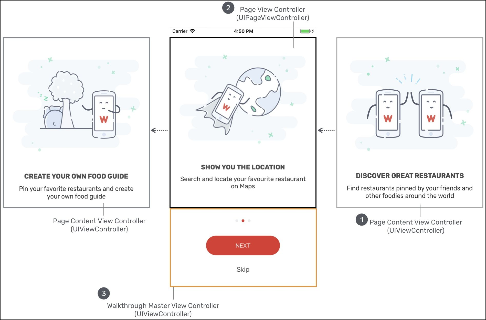
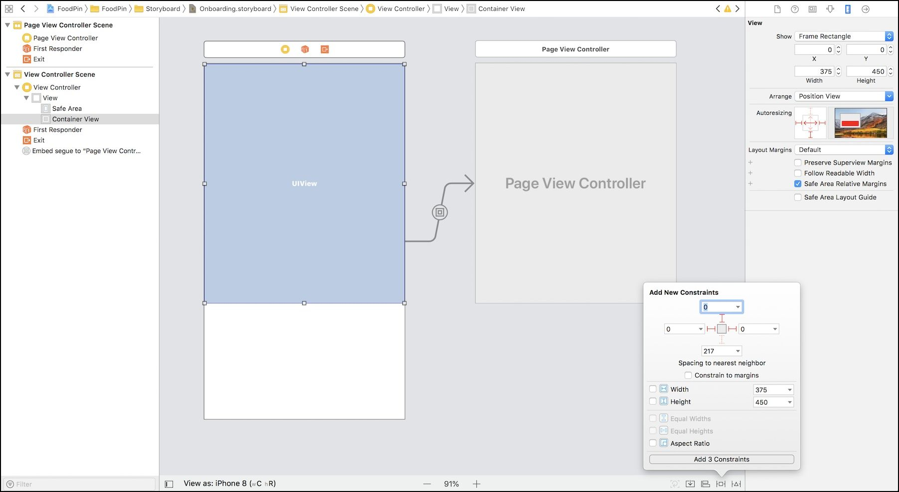
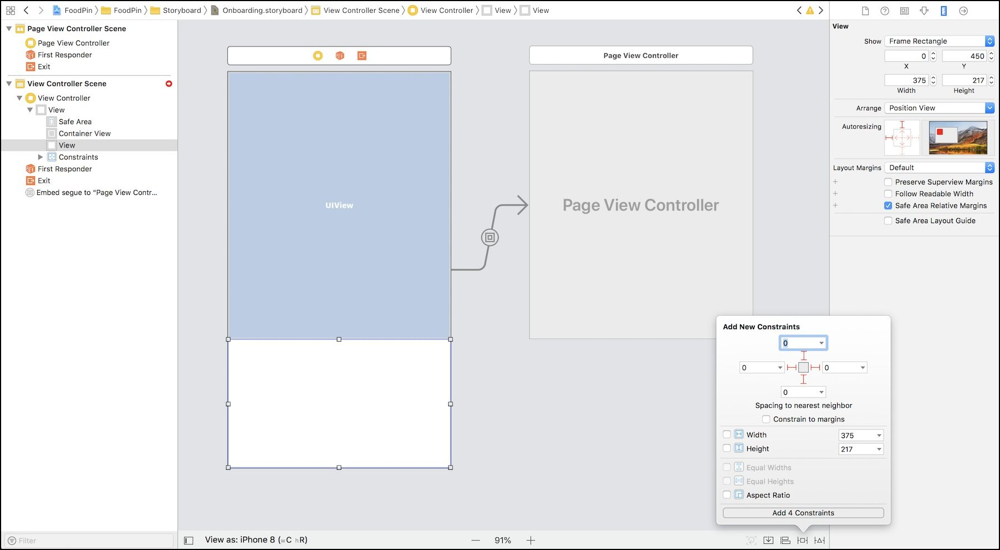
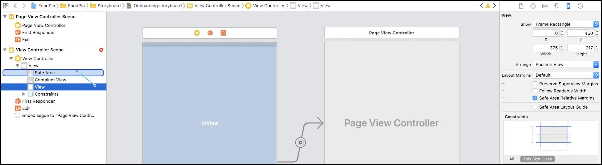
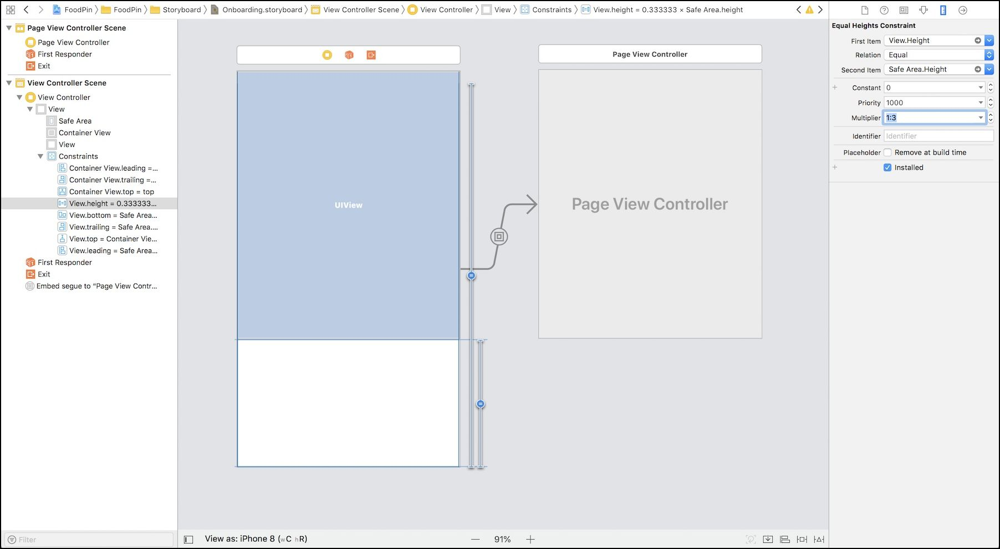
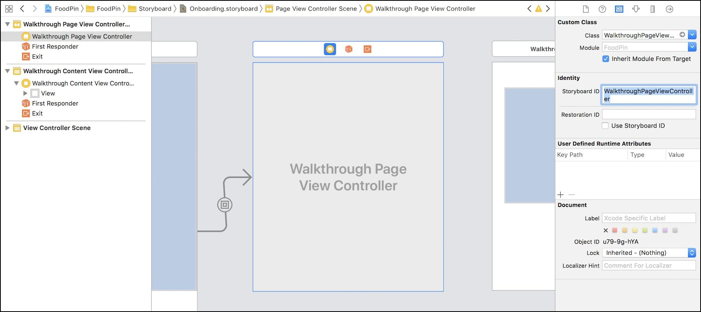
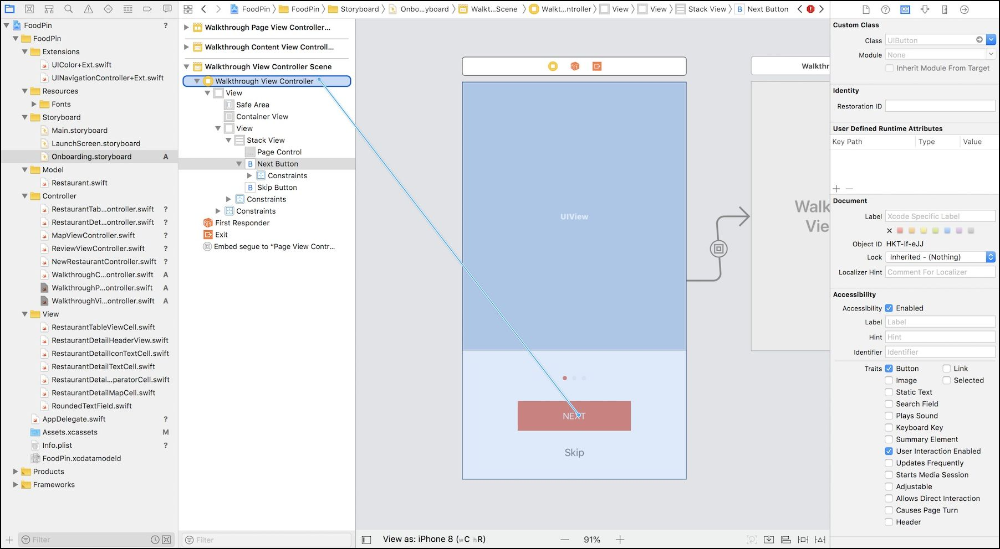
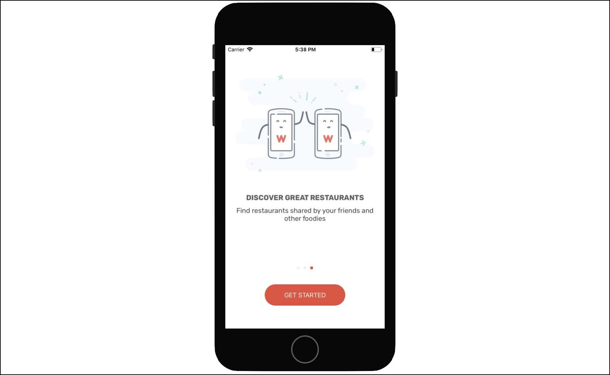
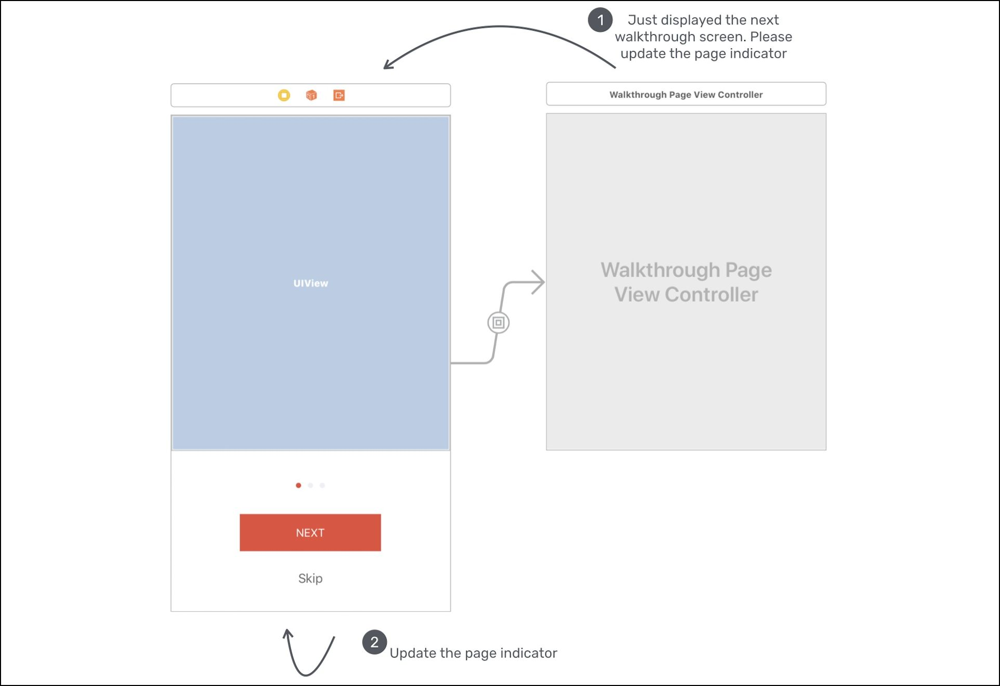

# Chapter 21 Building Walkthrough Screens with UIPageViewController and Container Views

## 演示屏幕


- 最终效果                        


- 其他应用的演示屏幕示例：  
                                                         

UIPageViewController 的4个特性：  
The UIPageViewController class is a highly configurable class. You're allowed to define:  
1. the orientation of the page views – vertical or horizontal（设置水平或垂直）  
2. the transition style – page curl transition style or scrolling transition style（设置翻页样式）  
3. the location of the spine – only applicable to page curl transition style  
4. the space between pages – only applicable to scrolling transition style to define the inter-page spacing  


## A Quick Look at the Walkthrough Screens  
- 操作演示（分为三个屏幕）：  


## Creating a New Storyboard for UIPageViewController

1. 新建 Storyboard（故事板）， 名称：Onboarding 


2. 拖拽一个【Page View Controller】到故事板
- Figure 21-4. Adding a UIPageViewController to the storyboard

设置：
- 【转场风格transition style】：【Scroll】
- 【页面视图控制器storyboard ID】：【WalkthroughController】


## Understanding Page View Controllers and Container Views 理解翻页视图控制器和容器视图
- 操作示例：既可以滑动图片向前向后，也可以点击【NEXT】按钮  


### 实现步骤
1. 我们有一个视图控制器，上面会放置图片和一些描述标签；
2. 创建一个 Class 
3. 设置按钮的事件

## Designing the Master View Controller设计主视图控制器

1. 在 Onboarding.storyboard 新增一个【View Controller】，然后拖拽一个【Container View】到视图控制器中，同时设置这个容器的大小为【375x450 points】；容器视图会作为一个占位对象显示在视图控制器中，旁边会有一个子视图控制器关联。如果你修改容器视图的大小，子视图控制器也会自动修改大小。  
  
2. 因为这个子视图控制器是Xcode自动生成的，所以我们选择它的【view controller】，然后点击 Delete 按钮删除它。

3. 接下来，点击选择【Container View】，拖拽到【page view controller】，释放后选择【Embed】选项。【page view controller】也自动变小了（和【Container View】大小一致）


4. 选择【Container View】，添加3个约束，上左右都为0  


5. 接下来设计视图的下半部分。首先拖拽一个【View】对象到视图控制器，设置位置和大小（X：0，Y：450，Width：375，Heigh：217），接下来给【View】添加4个约束，上下左右都为0，记得不要勾选【Contrain to margins】：  
  

这样设置约束后，Xcode会发现有布局错误。原因是我们没有给视图定义高度约束。这里我们希望让【Container View】占据三分之二的高度。下面我们来实现它。
	1. 首先，在【document outline】选择【View】对象，然后把它拖拽到【Safe Area】上，然后在弹出的对话框中选择【Equal Heights】。This defines a height constraint for the view,saying that its height should equal the height of the safe area.
	
	2. 接下来，设置【Container View】的高度约束，打开【Size inspector】，设置【multipler from 1 to 1:3】。
	

6. 接着，我们添加按钮和页面指示器到空的View中。
拖拽一个按钮到视图中，设置属性：
	- width: 190
	- height: 50
	- title: NEXT
	- font:　Subhead - Text style
	- font color: white
	- background color: red (#E74C3C)

第二个按钮，在NEXT按钮正下方：
	- title: Skip
	- font: Body - Text style
	- font color: dark gray

再拖拽一个【page control】对象到NEXT按钮的正上方
	- tint color: light gray(#EFEFF4)
	- current page color: red(#E74C3C)


　　

7. 添加约束

NEXT 按钮：　　
- width: 190
- height: 50	

8. 整合成StackView　　

同时选择page control、 NEXT按钮和Skip按钮，然后点击【Embed】按钮，选择【StackView】，这样3个控件形成垂直方向的StackView。然后设置属性 【spacing】 为 20。最后添加两个约束　　

- Horizontally in Container: 0
- Vertically in Containe: 0


## Designing the Page Content View Controller

接下来设置主视图控制器和页面视图控制器

1. 新增一个【view controller】，设置Size为【Freeform】，改变【height】为【451】，接下来在这个视图控制器上添加控件；
2. 新增一个【image view】，设置大小为【327x229 points】；
3. 新增一个【label】，
	1. name: HEADING
	2. font: Rubik
	3. font style: Bold
	4. alignment: center
	5. font color: dark gray(#606060)
4. 再新增一个【label】
	1. name: Subheading
	2. font: Rubik
	3. font style: Regular
	4. size: 16
	5. alignment: center
	6. font color: light gray(#424242)

如图所示                                                   


5. 选择两个label，然后点击【Embed】，选择【StackView】，设置属性，【alignment】 为 【center】，【spacing】为【10】；
6. 选择【StackView】和【image view】，然后点击【Embed】，选择【StackView】，设置属性，【alignment】 为 【center】，【spacing】为【50】；
7. 选择上面创建的【StackView】，添加约束上下左右分别为：50，10，24，24。


8. 设置【image view】的约束，新增约束，勾选【Aspect Ratio】
9. 设置buttom（Safe Area button）的约束，把【Relation】从【Equal】设置为【Great than or Equal】     


## Creating WalkthroughContentViewController Class

1. 创建类 Creating WalkthroughContentViewController ,放到 controller文件夹下：

```swift
import UIKit

class WalkthroughContentViewController: UIViewController {

}
```

2. 定义各种 outlet 和变量：
```swift
@IBOutlet var headingLabel: UILabel! {
	didSet {
		headingLabel.numberOfLines = 0 // 支持多行
	}
}
@IBOutlet var subHeadingLabel: UILabel! {
	didSet {
		subHeadingLabel.numberOfLines = 0 // 支持多行
	}
}
@IBOutlet var contentImageView: UIImageView!
// 当前页的下标
var index = 0
var heading = ""
var subHeading = ""
var imageFile = ""

```

3. 接下来修改 viewDidLoad() 方法，设置各种控件的属性：
```swift
override func viewDidLoad() {
	super.viewDidLoad()
	
	headingLabel.text = heading
	subHeadingLabel.text = subHeading
	contentImageView.image = UIImage(named: imageFile)
}
```

4. 建立UI控件和outlet变量的链接
	1. 选择【page content view controller】，设置【custom class】为【WalkthroughContentViewController】
	2. 设置【storyboard ID】为【WalkthroughContentViewController】
	3. 在【document outline】中选择【page content view controller】，然后点击右键，分别建立链接：
		1. Connect the headingLabel outlet with the HEADING label.
		2. Connect the subHeadingLabel outlet with the Subheading label.
		3. Connect the contentImageView outlet with the Image View object.


## Implementing the Page View Controller 实现页面视图控制器

这里有两种方式告诉 UIPageViewController 需要显示什么，你可通过提供【content view controllers】，也可以使用数据源。
如果是前者，调用 setViewControllers(_:direction:animated:completion:) 方法就可以了。

我的的应用支持手势操作，所以需要使用数据源方式。每次用户从一个页面导航到另一个页面时，数据源对象都会做出相应的响应。

数据源对象必须符合 UIPageViewControllerDataSource 协议，实现两个方法 pageViewController(_:viewControllerBefore:) 和pageViewController(_:viewControllerAfter:)。

1. 创建 WalkthroughPageViewController 并采用 UIPageViewControllerDataSource 协议：

```swift
import UIKit

class WalkthroughPageViewController: UIPageViewController, UIPageViewControllerDataSource {
}
```
2. 声明和初始化各种变量：
```swift
var pageHeadings = ["CREATE YOUR OWN FOOD GUIDE", "SHOW YOU THE LOCATION", "DISCOVER GREAT RESTAURANTS"]
var pageImages = ["onboarding-1", "onboarding-2", "onboarding-3"]
var pageSubHeadings = ["Pin your favorite restaurants and create your own food guide",
					   "Search and locate your favourite restaurant on Maps",
					   "Find restaurants shared by your friends and other foodies"]

var currentIndex = 0
```

3. 实现两个协议需要实现的方法：
```swift
func pageViewController(_ pageViewController: UIPageViewController, 
		viewControllerBefore viewController: UIViewController) -> UIViewController? {
	var index = (viewController as! WalkthroughContentViewController).index
	index -= 1
	
	return contentViewController(at: index)
}

func pageViewController(_ pageViewController: UIPageViewController, 
		viewControllerAfter viewController: UIViewController) -> UIViewController? {
	var index = (viewController as! WalkthroughContentViewController).index
	index += 1
	
	return contentViewController(at: index)
}
```
这两个方法很简单，如果是向前翻页，则index减1，如果是向后翻，则index加1。

4. 实现辅助方法 contentViewController(at:) 
```swift
func contentViewController(at index: Int) -> WalkthroughContentViewController? {
	if index < 0 || index >= pageHeadings.count {
		return nil // 如果下标越界，直接退出
	}
	
	// Create a new view controller and pass suitable data. 根据名称创建storyboard对象
	let storyboard = UIStoryboard(name: "Onboarding", bundle: nil)
	// 获取翻页内容视图控制器
	if let pageContentViewController = storyboard.instantiateViewController(withIdentifier: "WalkthroughContentViewController")
			as? WalkthroughContentViewController {
		// 设置各项属性值
		pageContentViewController.imageFile = pageImages[index]
		pageContentViewController.heading = pageHeadings[index]
		pageContentViewController.subHeading = pageSubHeadings[index]
		pageContentViewController.index = index
		
		return pageContentViewController
	}
	
	return nil
}
```

5. 最后，更新 viewDidLoad() 方法
```swift
override func viewDidLoad() {
	super.viewDidLoad()

	// Set the data source to itself
	dataSource = self
	
	// Create the first walkthrough screen
	if let startingViewController = contentViewController(at: 0) {
		setViewControllers([startingViewController], direction: .forward, animated: true, completion: nil)
	}
}
```
先设置数据源，然后通过辅助方法活动第一个页面，再通过调用setViewControllers方法将页面放到视图控制器中。

6. 最后，在storyboard中，将【page view controller】的类设置为【WalkthroughPageViewController】，【storyboard ID】为【WalkthroughPageViewController】



## Implementing the Walkthrough View Controller 实现翻页视图控制器

1. 创建 WalkthroughViewController 类

```swift
import UIKit

class WalkthroughViewController: UIViewController {
}
```

2. 声明outlet变量：
```swift
@IBOutlet var pageControl: UIPageControl!
@IBOutlet var nextButton: UIButton! {
	didSet {
		nextButton.layer.cornerRadius = 25.0
		nextButton.layer.masksToBounds = true
	}
}
@IBOutlet var skipButton: UIButton!
```

3. 接下来设置【walkthrough view controller】，类为【WalkthroughViewController】，【storyboard ID】为【WalkthroughViewController】：
4. 然后选择【walkthrough view controller】，点击右键，链接UI组件：
	1. Connect the pageControl outlet to the page control
	2. Connect the nextButton outlet to the NEXT button
	3. Connect the skipButton outlet to the Skip button

  

## Displaying the Walkthrough Screens 显示演示画面

1. 在 RestaurantTableViewController 中插入下面的方法：
```swift
override func viewDidAppear(_ animated: Bool) {
	let storyboard = UIStoryboard(name: "Onboarding", bundle: nil)
	if let walkthroughViewController = storyboard.instantiateViewController(withIdentifier: "WalkthroughViewController")
											as? WalkthroughViewController {
		present(walkthroughViewController, animated: true, completion: nil)
	}
}
```
viewDidAppear()方法在进入【walkthrough view controller】时会自动调用。

  

## Handling the Page Indicator and the Next/Skip Buttons 处理页面指示器和下一页/忽略按钮

两个问题待解决：
- Next和Skip按钮不工作
- 最后一屏要隐藏Skip按钮，而且Next按钮必须把内容【NEXT】改为【GET STARTED】
- 页面指示器不工作，红点不会根据当前页的内容改变位置

1. 首先实现Skip按钮的方法：
```swift
@IBAction func skipButtonTapped(sender: UIButton) {
	dismiss(animated: true, completion: nil)
}
```
直接 dismiss 当前的视图控制器

2. 实现 NEXT 按钮的方法：  

	1. 先在 WalkthroughPageViewController 添加新方法forwardPage()
	```swift
	func forwardPage() {
		currentIndex += 1
		if let nextViewController = contentViewController(at: currentIndex) {
			setViewControllers([nextViewController], direction: .forward, animated: true, completion: nil)
		}
	}
	```
	当这个方法被调用时，会自动创建下一个内容视图控制器，然后通过调用内置的setViewControllers方法展示下一个视图控制器。

	2. 接下来在 WalkthroughViewController 添加一个属性：
	```swift
	var walkthroughPageViewController: WalkthroughPageViewController?
	```
	这个属性存储对 WalkthroughPageViewController 对象的引用。
	后面我们将使用它来找到当前页的下标。

	3. 在 WalkthroughViewController 中添加prepare方法：
	```swift
	override func prepare(for segue: UIStoryboardSegue, sender: Any?) {
		let destination = segue.destination
		if let pageViewController = destination as? WalkthroughPageViewController {
			walkthroughPageViewController = pageViewController
			walkthroughPageViewController?.walkthroughDelegate = self
		}
	}
	```
	这个方法用于调用【Walkthrough Page View Controller】中的容器视图。

	4. 在 WalkthroughViewController 中添加 nextButtonTapped action方法
	```swift
	@IBAction func nextButtonTapped(sender: UIButton) {
		if let index = walkthroughPageViewController?.currentIndex {
			switch index {
			case 0...1:
				walkthroughPageViewController?.forwardPage()
			case 2:
				dismiss(animated: true, completion: nil)
			default: break
			}
		}
		
		updateUI()
	}
	```
	如果有下一页，就继续翻页，如果没有，去掉当前视图。最后更新UI。

	```swift
	func updateUI() {
		
		if let index = walkthroughPageViewController?.currentIndex {
			switch index {
			case 0...1:
				nextButton.setTitle("NEXT", for: .normal)
				skipButton.isHidden = false
			case 2:
				nextButton.setTitle("GET STARTED", for: .normal)
				skipButton.isHidden = true			
			default: break
			}
			
			pageControl.currentPage = index
		}        
	}
	```
	updateUI方法做了两件事，首先根据下标，设置NEXT按钮的title及Skip按钮是否隐藏，其次设置页面指示器的当前值的属性。

	   

3. 建立 UI 控件的链接：选择【Walkthrough View Controller】，点击

  


## Updating the Page Indicator for Gesture-based Navigation 根据手势更新页面指示器



1. 首先在 WalkthroughPageViewController 中建立一个代理WalkthroughPageViewControllerDelegate：
```swift
protocol WalkthroughPageViewControllerDelegate: class {
    func didUpdatePageIndex(currentIndex: Int)
}
```
2. 接下来新建属性：
```swift
weak var walkthroughDelegate: WalkthroughPageViewControllerDelegate?
```

3. 遵守 UIPageViewControllerDelegate 协议：
```swift
class WalkthroughPageViewController: UIPageViewController, UIPageViewControllerDataSource, UIPageViewControllerDelegate
```

4. 实现pageViewController方法：

```swift
func pageViewController(_ pageViewController: UIPageViewController,
						didFinishAnimating finished: Bool,
						previousViewControllers: [UIViewController],
						transitionCompleted completed: Bool) {
	if completed {
		if let contentViewController = pageViewController.viewControllers?.first as? WalkthroughContentViewController {
			currentIndex = contentViewController.index
			walkthroughDelegate?.didUpdatePageIndex(currentIndex: contentViewController.index)
		}
	}
}
```
先检查转场是否已完成并且得到当前的下标，然后调用didUpdatePageIndex方法。

5. 在此之前，在viewDidLoad()设置代理：
```swift
delegate = self
```

6. 让 WalkthroughViewController 遵守 WalkthroughPageViewControllerDelegate 协议：
```swift
class WalkthroughViewController: UIViewController, WalkthroughPageViewControllerDelegate
```

7. 在 WalkthroughViewController 中实现必须的方法：
```swift
func didUpdatePageIndex(currentIndex: Int) {
	updateUI()
}
```

8. 更新 prepare 方法，设置代理
```swift
override func prepare(for segue: UIStoryboardSegue, sender: Any?) {
	let destination = segue.destination
	if let pageViewController = destination as? WalkthroughPageViewController {
		walkthroughPageViewController = pageViewController
		// 设置代理
		walkthroughPageViewController?.walkthroughDelegate = self
	}
}
```
## Wait! Another Bug!
每次都会显示向导，要记住用户是否已经浏览过向导页面

## Introducing UserDefaults 介绍 UserDefaults

- 设置：
```swift
UserDefaults.standard.set(true, forKey: "hasViewedWalkthrough")
```


```swift
array(forKey:)
bool(forKey:)
data(forKey:)
dictionary(forKey:)
float(forKey:)
integer(forKey:)
object(
```

## Working with UserDefaults 使用

- nextButtonTapped
```swift
@IBAction func nextButtonTapped(sender: UIButton) {
	
	if let index = walkthroughPageViewController?.currentIndex {
		switch index {
		case 0...1:
			walkthroughPageViewController?.forwardPage()
		case 2:
			// 保存状态
			UserDefaults.standard.set(true, forKey: "hasViewedWalkthrough")
			dismiss(animated: true, completion: nil)
		default: break
		}
	}
	
	updateUI()
}
```
- skipButtonTapped
```swift
@IBAction func skipButtonTapped(sender: UIButton) {
	// 保存状态
	UserDefaults.standard.set(true, forKey: "hasViewedWalkthrough")
	dismiss(animated: true, completion: nil)
}
```

- RestaurantTableViewController
```swift
override func viewDidAppear(_ animated: Bool) {
	// 如果显示过向导，就不再显示了
	if UserDefaults.standard.bool(forKey: "hasViewedWalkthrough") {
		return
	}
	
	let storyboard = UIStoryboard(name: "Onboarding", bundle: nil)
	if let walkthroughViewController = storyboard.instantiateViewController(withIdentifier: "WalkthroughViewController")
											as? WalkthroughViewController {
		present(walkthroughViewController, animated: true, completion: nil)
	}
}
```

## Summary 小结

1. UIPageViewController的使用
2. container view 的使用
3. UserDefaults 的使用